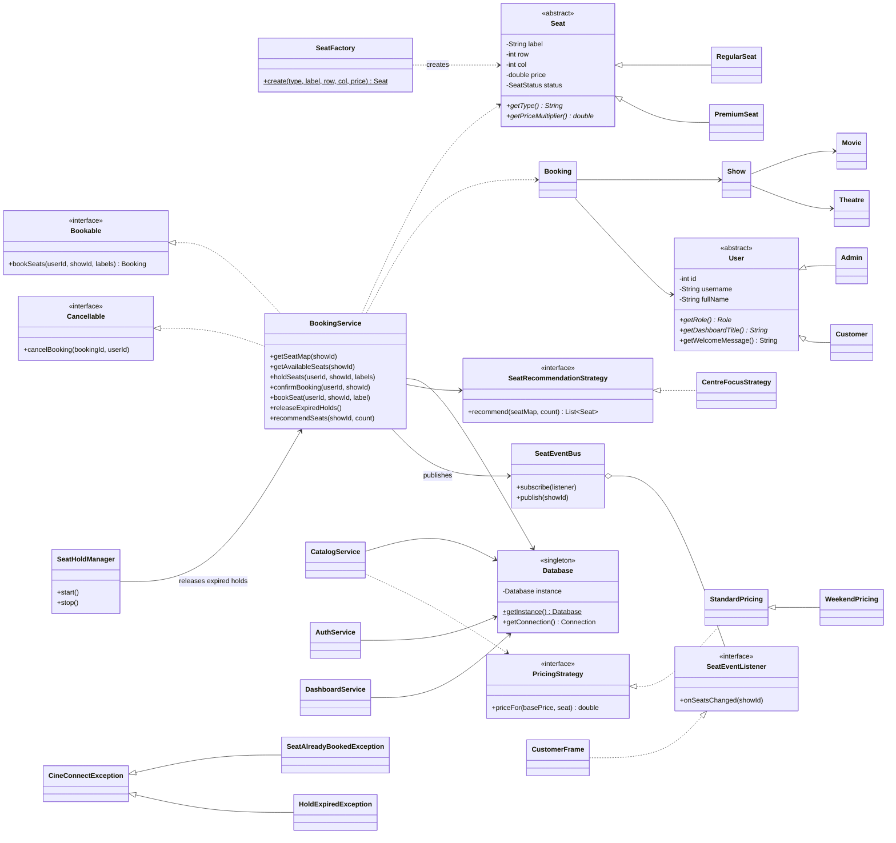

# CineConnect UML class diagram

GitHub renders the Mermaid block below. To export an image for the report, paste it into <https://mermaid.live>.

```mermaid
classDiagram
    direction LR

    class User {
        <<abstract>>
        -int id
        -String username
        -String fullName
        +getRole()* Role
        +getDashboardTitle()* String
        +getWelcomeMessage() String
    }
    class Admin
    class Customer
    User <|-- Admin
    User <|-- Customer

    class Seat {
        <<abstract>>
        -String label
        -int row
        -int col
        -double price
        -SeatStatus status
        +getType()* String
        +getPriceMultiplier()* double
    }
    class RegularSeat
    class PremiumSeat
    class SeatFactory {
        +create(type, label, row, col, price)$ Seat
    }
    Seat <|-- RegularSeat
    Seat <|-- PremiumSeat
    SeatFactory ..> Seat : creates

    class Movie
    class Theatre
    class Show
    class Booking
    Show --> Movie
    Show --> Theatre
    Booking --> Show
    Booking --> User

    class Bookable {
        <<interface>>
        +bookSeats(userId, showId, labels) Booking
    }
    class Cancellable {
        <<interface>>
        +cancelBooking(bookingId, userId)
    }
    class BookingService {
        +getSeatMap(showId)
        +getAvailableSeats(showId)
        +holdSeats(userId, showId, labels)
        +confirmBooking(userId, showId)
        +bookSeat(userId, showId, label)
        +releaseExpiredHolds()
        +recommendSeats(showId, count)
    }
    Bookable <|.. BookingService
    Cancellable <|.. BookingService
    BookingService ..> Seat
    BookingService ..> Booking

    class SeatHoldManager {
        +start()
        +stop()
    }
    SeatHoldManager --> BookingService : releases expired holds

    class Database {
        <<singleton>>
        -Database instance
        +getInstance()$ Database
        +getConnection() Connection
    }
    BookingService --> Database
    CatalogService --> Database
    AuthService --> Database
    DashboardService --> Database

    class PricingStrategy {
        <<interface>>
        +priceFor(basePrice, seat) double
    }
    class StandardPricing
    class WeekendPricing
    PricingStrategy <|.. StandardPricing
    StandardPricing <|-- WeekendPricing
    CatalogService ..> PricingStrategy

    class SeatRecommendationStrategy {
        <<interface>>
        +recommend(seatMap, count) List~Seat~
    }
    class CentreFocusStrategy
    SeatRecommendationStrategy <|.. CentreFocusStrategy
    BookingService --> SeatRecommendationStrategy

    class SeatEventBus {
        +subscribe(listener)
        +publish(showId)
    }
    class SeatEventListener {
        <<interface>>
        +onSeatsChanged(showId)
    }
    SeatEventBus o-- SeatEventListener
    BookingService --> SeatEventBus : publishes
    CustomerFrame ..|> SeatEventListener

    class SeatAlreadyBookedException
    class HoldExpiredException
    class CineConnectException
    CineConnectException <|-- SeatAlreadyBookedException
    CineConnectException <|-- HoldExpiredException
```
